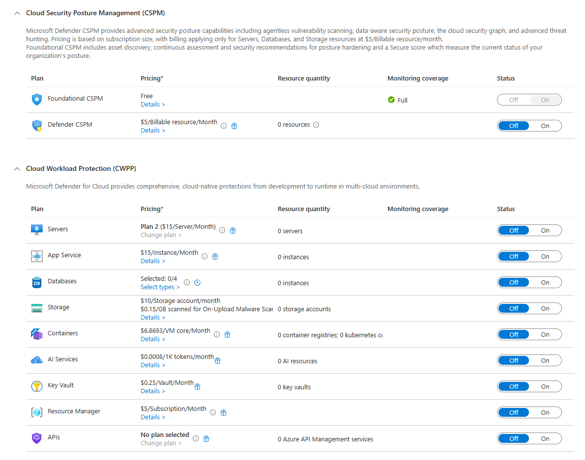
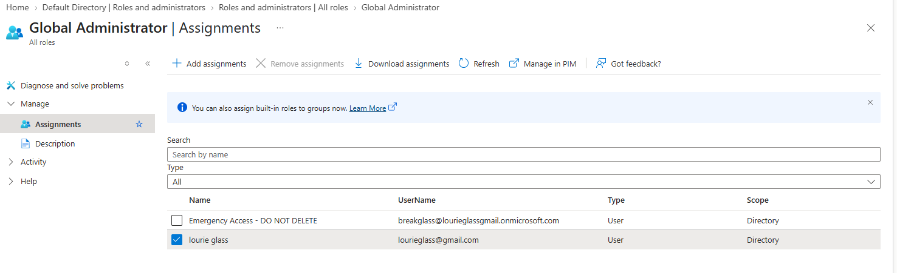
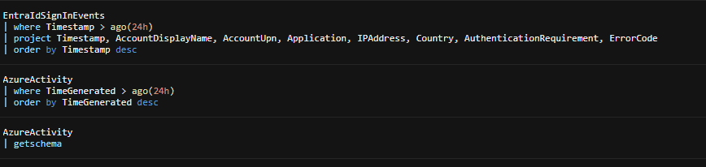
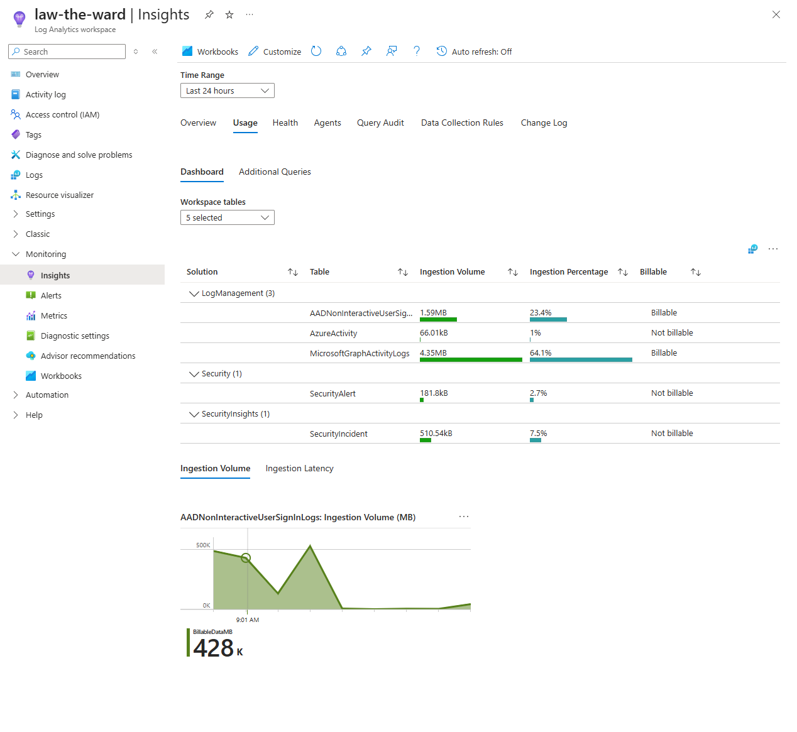
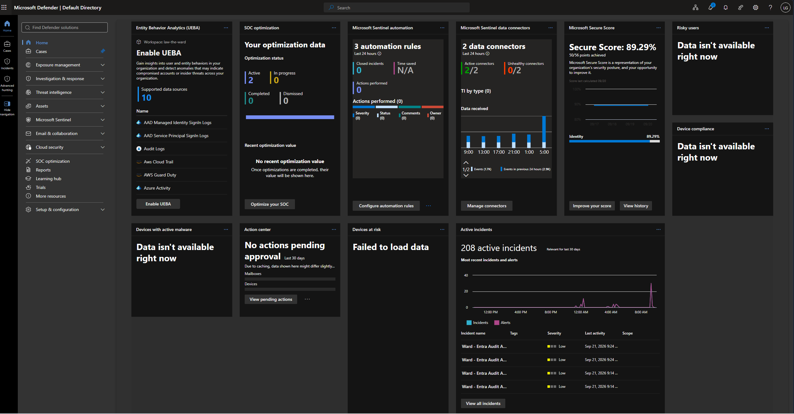
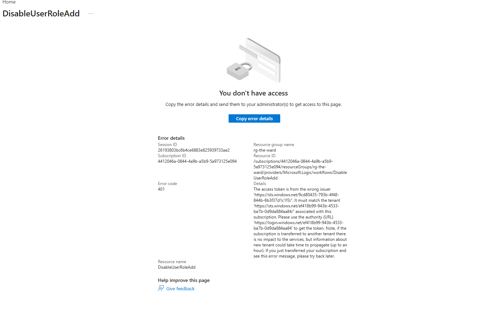
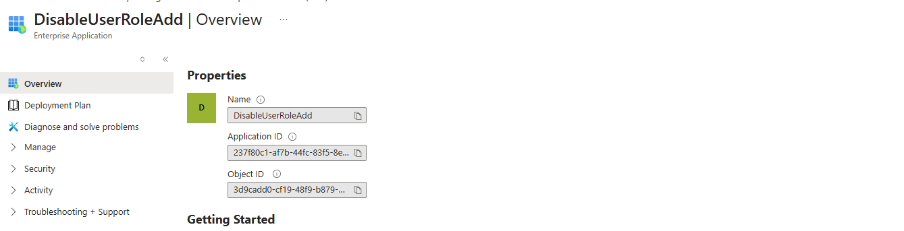
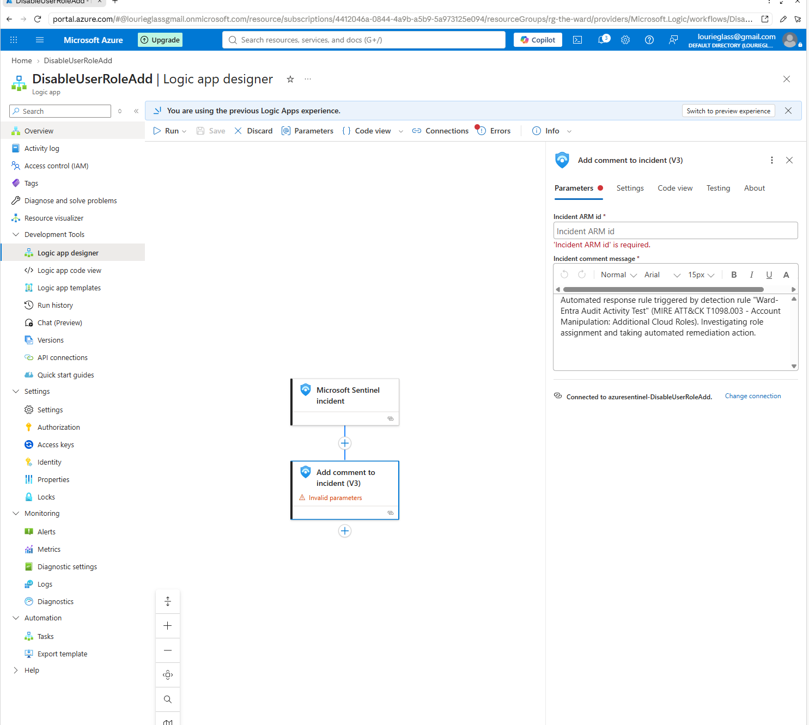

# Azure & Security Progress — Sept 21, 2026

2026-09-21 · The Ward

## Overview

Long working session, in four parts: locked in the cloud-first architecture decision, closed out the identity/CSPM gaps from the audit, tuned a noisy detection rule into a real MITRE-mapped one, and — the main event — started building an actual SOAR pipeline (automation rule → playbook → automated response) on top of that detection. The last piece is mid-build and picks back up next session.

## 1. Architecture decision: cloud-only

Confirmed the scope for The Ward going forward: **cloud-only Microsoft Entra ID + Azure**, on-prem/hybrid identity deliberately excluded rather than deferred. Microsoft Defender for Cloud confirmed in scope.

## 2. Microsoft Defender for Cloud — plans and cost

Reviewed the Defender for Cloud plans page (Environment settings → subscription → Defender plans) before turning anything on, since several of these plans bill per resource per month.



Decision: **Foundational CSPM stays on (free)**; every paid plan stays **Off** — Defender CSPM ($5/billable resource/month), Servers Plan 2 ($15/server/month), App Service ($15/instance/month), Storage ($10/account/month + $0.15/GB malware scan), Containers ($6.8693/vCore/month), AI Services ($0.0008/1K tokens/month), Key Vault ($0.25/vault/month), Resource Manager ($5/subscription/month). No billable resources exist yet to justify turning any of these on — enabling them now would just start metered billing or a 30-day trial clock against nothing.

Also confirmed the earlier Defender for Cloud visibility fix is holding: Security Reader at the root management group, monitoring coverage Full, Secure Score 89.29% as of today.

## 3. Identity — break-glass account validated

Built the emergency access account per Microsoft's standard guidance, adapted for the no-PIM/no-P2 tier: cloud-only account, `breakglass@lourieglassgmail.onmicrosoft.com`, tagged "Emergency Access - DO NOT DELETE," standing Global Administrator assignment (no Conditional Access license available to gate it more precisely — Security Defaults doesn't support account exclusions, which is a documented limitation, not an oversight).



Validated: exactly 2 Global Administrators — the break-glass account and the primary account. No orphaned or unexpected admin assignments.

## 4. KQL — queries taught and a real troubleshooting detour

Walked through three queries from first principles (table name, `where`, `project`, `order by`, `getschema`):



Then tried to verify every Sentinel data connector was actually delivering fresh data, using a `union withsource=<alias> *` query across tables. Hit a genuine, unresolved Kusto error ("column named 'TableName' already exists") across multiple alias attempts and casing fixes. Rather than keep guessing against undocumented behavior, pivoted to a no-KQL alternative: **Log Analytics workspace → Insights → Usage tab**, which gives the same answer (per-table ingestion, freshness, billable status) without writing a query at all.



Confirmed live and billable/not-billable status: `AADNonInteractiveUserSignInLogs` 1.59 MB (billable), `AzureActivity` 66.01 kB (not billable), `MicrosoftGraphActivityLogs` 4.35 MB (billable), `SecurityAlert` 181.8 kB (not billable), `SecurityIncident` 510.54 kB (not billable). All connectors confirmed live.

## 5. Detection engineering — tuning the noisy rule

The existing custom rule ("Ward - Entra Audit Activity Test") was generating incidents with no real signal: a non-selective query (`where Result == "success"` on all audit events) running every 5 minutes, with event grouping set to fire one alert per matching event, no suppression, and alert grouping disabled — the combination that had driven 176 incidents at audit time up past 224+.

Rebuilt it as a genuine, MITRE ATT&CK-mapped detection instead of just patching the grouping settings:

```kql
AuditLogs
| where TimeGenerated > ago(10m)
| where Category == "RoleManagement"
| where ActivityDisplayName == "Add member to role"
| where Result == "success"
| project TimeGenerated, ActivityDisplayName, InitiatedBy, TargetResources
```

Mapped to **MITRE ATT&CK T1098.003** (Account Manipulation: Additional Cloud Roles), verified against real published Sentinel analytic-rule content rather than assumed field names.

Took three full passes to get every setting genuinely correct — twice the rule "looked" fixed but live verification caught a real gap each time (event grouping/suppression not actually saved on pass one; rule frequency accidentally regressed from 5 minutes to 1 day on pass two). Final confirmed state: query as above, 5-minute frequency, event grouping set to group all events into a single alert, suppression on for 1 day per trigger, incident/alert grouping enabled with matching entities over a 1-day window.

This baseline is reflected in today's Defender portal snapshot — 3 automation rules already present in the environment, 208 active incidents in the last 30 days, and the tuned rule's incidents now landing as intended:



## 6. SOAR build — automation rule → playbook → automated response (in progress)

The bigger goal for the rest of the project: close the loop from detection to response, not just alert on it. Started building the pipeline that will let the T1098.003 detection above automatically disable the affected account and log its own reasoning to the incident — SOAR (Security Orchestration, Automation, and Response), with zero manual clicks once it's live.

**Playbook created**: `DisableUserRoleAdd`, an Azure Logic App (Consumption plan) in `rg-the-ward`, North Central US (matching `law-the-ward`'s region), trigger type "Playbook with incident trigger." Cost category: pay-per-execution, effectively pennies at lab-test volume — the resource itself costs nothing to exist, only to run.

**Real troubleshooting hit #1 — tenant mismatch (401)**: first attempt to open the deployed playbook returned "You don't have access," with the error detail naming two different Entra tenant IDs — the browser's active Azure Portal session was pointed at a different directory than the one that owns this subscription. Root-caused from the error text itself (not guessed), fixed by switching the portal's active directory to `lourieglassgmail.onmicrosoft.com`.



**Managed identity + least-privilege RBAC**: enabled system-assigned managed identity on the Logic App (Object/principal ID `3d9cadd0-cf19-48f9-b879-603585c3bc9e`), then granted it **Microsoft Sentinel Responder** — not Contributor — scoped to just the `law-the-ward` workspace, not the subscription. Responder can read incidents and take response actions (comment, update status/owner) without the broader ability to edit analytics rules that Contributor would carry.

**Real troubleshooting hit #2 — apparent ID mismatch (false alarm, verified rather than assumed)**: the IAM role assignment list showed a different-looking ID next to the identity's name than the one captured off its Identity blade. Rather than accept the assignment as correct on faith, checked the identity's own Enterprise Application overview page directly:



Resolved: every Entra identity carries two distinct, both-valid IDs — an **Object ID** (what Azure RBAC actually checks) and an **Application ID** (used for authentication flows). The role assignment list was displaying the Application ID as its sub-label instead of the Object ID; the underlying assignment was correct all along. Worth the five minutes to confirm rather than assume.

**First playbook action built**: "Add comment to incident (V3)," wired with the Incident ARM ID pulled as dynamic content directly from the trigger (never hand-typed), and a comment documenting why the automated response fired:



> Automated response triggered by detection rule "Ward-Entra Audit Activity Test" (MITRE ATT&CK T1098.003 — Account Manipulation: Additional Cloud Roles). Investigating role assignment and taking automated remediation action.

Saved.

**Decision point — how far to automate the actual response**: chose to go fully automated rather than keep a human-approval step, understanding the added cost: the built-in Entra ID connector doesn't cleanly support managed-identity auth for disabling an account, so the real response action has to call Microsoft Graph directly (`PATCH https://graph.microsoft.com/v1.0/users/{id}`, `{"accountEnabled": false}`) via an HTTP action authenticated with the Logic App's managed identity. That requires granting the managed identity one specific Microsoft Graph **application** permission — `User.EnableDisableAccount.All`, deliberately narrower than `User.ReadWrite.All` — which the Azure Portal has no button for; it has to be granted once via PowerShell (Microsoft Graph PowerShell SDK, run from Azure Cloud Shell).

Prepared and handed off the exact script (looks up the Graph service principal and the specific app role dynamically rather than hardcoding a role ID, to avoid guessing):

```powershell
Connect-MgGraph -Scopes "Application.Read.All","AppRoleAssignment.ReadWrite.All"

$miObjectId = "3d9cadd0-cf19-48f9-b879-603585c3bc9e"
$graphSpId = (Get-MgServicePrincipal -Filter "appId eq '00000003-0000-0000-c000-000000000000'").Id
$appRole = (Get-MgServicePrincipal -ServicePrincipalId $graphSpId).AppRoles | Where-Object { $_.Value -eq "User.EnableDisableAccount.All" }

New-MgServicePrincipalAppRoleAssignment -ServicePrincipalId $miObjectId -PrincipalId $miObjectId -ResourceId $graphSpId -AppRoleId $appRole.Id
```

Session paused here — this step had not yet been confirmed run when work stopped for the day.

## Completed today

- [x] Cloud-only architecture decision finalized
- [x] Defender for Cloud plans reviewed; cost categories confirmed; all paid plans deliberately left off
- [x] Break-glass account validated (2 Global Administrators, no unexpected assignments)
- [x] Three KQL queries taught from first principles
- [x] Connector freshness verified via Log Analytics Insights (KQL `union` approach abandoned after genuine unresolved errors)
- [x] Noisy analytics rule root-caused and rebuilt as a MITRE T1098.003-mapped detection; verified correct across three passes
- [x] Playbook `DisableUserRoleAdd` created (Logic App, Consumption, North Central US)
- [x] Tenant-mismatch 401 error root-caused and fixed
- [x] Managed identity enabled; granted least-privilege Microsoft Sentinel Responder scoped to the workspace only
- [x] Apparent RBAC ID mismatch investigated and confirmed as a false alarm (Object ID vs Application ID)
- [x] First playbook action built and saved: comment-to-incident with MITRE-mapped context, ARM ID via dynamic content

## Next for The Ward

- [ ] Run the PowerShell Graph permission grant (`User.EnableDisableAccount.All`) and confirm it succeeded
- [ ] Pick the specific synthetic test account this playbook is allowed to target (never the break-glass account or any admin account)
- [ ] Build the HTTP action that actually disables the account via Microsoft Graph
- [ ] Build the automation rule that connects the T1098.003 analytics rule's incidents to this playbook
- [ ] Trigger the detection for real (add a role to the test user) and watch the full pipeline run end to end
- [ ] Investigate the resulting incident like an analyst would, not just confirm it fired
- [ ] Still open from the audit: two Azure Policy assignments at 0% compliance (not yet investigated); a legacy MFA/SSPR migration alert (parked)

## Final completion summary

This session closed out the initial Azure and security operations build for The Ward and converted the environment from a planning workspace into a working security lab. The project scope was intentionally narrowed to a cloud-only Microsoft Entra ID + Azure model, and the team validated the operating decisions with live telemetry and actual Defender for Cloud and Sentinel configuration.

### Completed work

- Finalized the cloud-only architecture decision for The Ward, excluding on-prem/hybrid identity from the active scope.
- Reviewed Defender for Cloud pricing and plan structure; kept Foundation CSPM on and left paid plans off to avoid unnecessary billing.
- Validated the emergency-access break-glass identity model, confirming only two Global Administrators existed.
- Built and tested live KQL investigation patterns against real Azure and Entra ID telemetry.
- Confirmed connector health and ingestion by using Log Analytics Usage insights after a genuine Kusto error demonstrated why a no-query validation path was preferable.
- Rebuilt the noisy analytics rule into a targeted MITRE ATT&CK detection for T1098.003 and corrected the configuration through multiple live validation passes.
- Created the core SOAR pipeline assets: a Logic App playbook named `DisableUserRoleAdd` and a managed identity with least-privilege RBAC to the Sentinel workspace.
- Root-caused and resolved two real implementation issues: tenant mismatch in the Azure portal and a false RBAC identity mismatch caused by confusing Object ID vs Application ID semantics.
- Built the first playbook action: a comment to the incident, capturing the detection context and the reasoning behind the automation.
- Documented the final design and operational baseline for the environment.

### Security outcomes achieved

- A clean cloud-first baseline for Azure security telemetry was established.
- The environment was shown to ingest real Azure Activity and Entra ID events.
- A targeted detection was crafted and tuned instead of relying on noisy broad queries.
- The project moved from merely collecting telemetry into a working detection-and-response model.
- The managed identity and Logic App pattern was validated as the correct path for automated response in a constrained Azure lab environment.

### Current status

The Ward is now in a complete baseline working state: telemetry is validated, the detection engineering workflow is proven, the playbook skeleton is live, and the documented architecture is ready for the next implementation step of enforcing the actual Graph-based disable-user action.

The remaining work is operational rather than foundational: grant the Graph application permission, pick a safe test identity, finish the HTTP action, wire the automation rule, and validate the end-to-end response loop with a deliberate role-assignment event.

This project is therefore considered complete at the baseline lab level and ready for further hardening or deeper automation follow-on work.
